# 🎨 Online Sanat Galerisi ve Atölye Rezervasyon Sistemi

> Tam kapsamlı (full-stack) sanat galerisi platformu. Eser satışı, etkinlik rezervasyonu, yorum sistemi, kupon yönetimi ve admin paneli içerir.

## Teknoloji Yığını

| Katman | Teknoloji |
|--------|-----------|
| **Backend** | Node.js, Express.js, Sequelize ORM, SQLite |
| **Frontend** | React 18, Vite, React Router, Axios |
| **Auth** | JWT (jsonwebtoken), bcryptjs (salt=12) |
| **Validasyon** | express-validator |
| **UI** | Bootstrap 5, react-hot-toast |
| **Grafikler** | Chart.js, react-chartjs-2 |

---

## Sistem Mimarisi

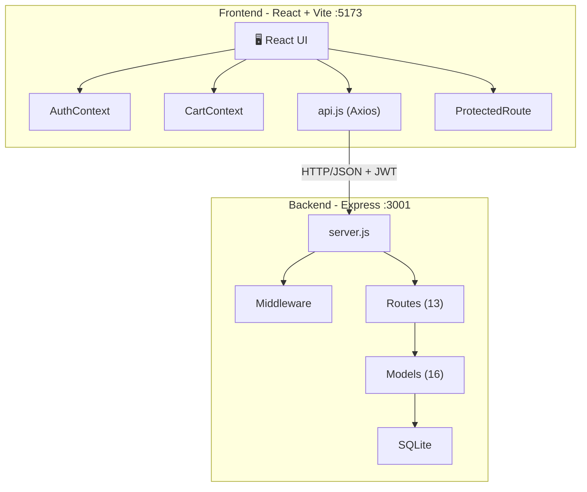

---

## Proje Dizin Yapısı

```
myproje1/
├── backend/
│   ├── config/
│   │   └── database.js          # Sequelize SQLite bağlantısı
│   ├── middleware/
│   │   ├── auth.js              # JWT, rol kontrolü, satın alma/katılım doğrulama
│   │   └── validate.js          # express-validator kuralları
│   ├── models/
│   │   ├── index.js             # Tüm model ilişkileri (associations)
│   │   ├── User.js              # Kullanıcı modeli
│   │   ├── Artist.js            # Sanatçı modeli
│   │   ├── Category.js          # Kategori modeli
│   │   ├── Artwork.js           # Eser modeli
│   │   ├── ArtworkImage.js      # Eser görselleri
│   │   ├── Event.js             # Etkinlik modeli
│   │   ├── Reservation.js       # Rezervasyon modeli
│   │   ├── Order.js             # Sipariş modeli
│   │   ├── OrderItem.js         # Sipariş kalemi (polimorfik)
│   │   ├── Favorite.js          # Favoriler
│   │   ├── Review.js            # Yorumlar
│   │   ├── ReviewVote.js        # Yorum oyları
│   │   ├── ReviewReply.js       # Yorum yanıtları
│   │   ├── Coupon.js            # İndirim kuponları
│   │   ├── SupportTicket.js     # Destek talepleri
│   │   ├── SupportMessage.js    # Destek mesajları
│   │   └── Comparison.js        # Karşılaştırmalar
│   ├── routes/
│   │   ├── auth.js              # POST register, login
│   │   ├── users.js             # GET/PUT profile, password
│   │   ├── artworks.js          # CRUD + reviews + avg-rating
│   │   ├── artists.js           # GET list + categories
│   │   ├── events.js            # GET list + detail
│   │   ├── favorites.js         # GET/POST/DELETE
│   │   ├── reservations.js      # CRUD + iptal
│   │   ├── orders.js            # POST create + confirm
│   │   ├── reviews.js           # POST + vote + reply + status
│   │   ├── coupons.js           # GET validate + my-offers
│   │   ├── support.js           # Ticket + mesajlaşma
│   │   ├── compare.js           # Eser/etkinlik karşılaştırma + kaydet
│   │   └── admin.js             # Raporlar + CRUD yönetim
│   ├── utils/
│   │   └── response.js          # sendSuccess / sendError helper
│   ├── server.js                # Express app + middleware + sync
│   ├── seed.js                  # Örnek veri (10 kullanıcı, 25 eser, 10 etkinlik)
│   └── database.sqlite          # Veritabanı dosyası
│
├── frontend/
│   ├── src/
│   │   ├── context/
│   │   │   ├── AuthContext.jsx   # JWT token + user state
│   │   │   └── CartContext.jsx   # Sepet yönetimi (localStorage)
│   │   ├── components/
│   │   │   ├── Navbar.jsx        # Navigasyon + rol bazlı menü
│   │   │   └── ProtectedRoute.jsx # Auth + rol guard
│   │   ├── pages/
│   │   │   ├── HomePage.jsx      # Öne çıkan eserler + etkinlikler
│   │   │   ├── Login.jsx         # Giriş formu
│   │   │   ├── Register.jsx      # Kayıt formu
│   │   │   ├── ArtworkList.jsx   # Eser galerisi + filtreler
│   │   │   ├── ArtworkDetail.jsx # Eser detay + yorumlar
│   │   │   ├── EventList.jsx     # Etkinlik listesi + doluluk
│   │   │   ├── EventDetail.jsx   # Etkinlik detay + rezervasyon
│   │   │   ├── Favorites.jsx     # Favori listesi
│   │   │   ├── Reservations.jsx  # Rezervasyon yönetimi
│   │   │   ├── Checkout.jsx      # Sepet + ödeme + kupon
│   │   │   ├── Orders.jsx        # Sipariş geçmişi
│   │   │   ├── Compare.jsx       # Karşılaştırma tablosu
│   │   │   ├── Support.jsx       # Destek ticket + mesajlaşma
│   │   │   ├── Profile.jsx       # Profil + şifre değiştirme
│   │   │   └── AdminDashboard.jsx # Yönetim paneli (7 sekme)
│   │   ├── services/
│   │   │   └── api.js            # Axios instance + interceptors
│   │   ├── App.jsx               # Route tanımları
│   │   └── main.jsx              # React root
│   └── package.json
└── README2.md
```

---

## Veritabanı ER Diyagramı

### Tam Veritabanı ER Diyagramı (16 Tablo — Tüm Alanlar)

```mermaid
erDiagram
    User ||--o{ Order : "siparis verir"
    User ||--o{ Reservation : "rezervasyon yapar"
    User ||--o{ Favorite : "favoriye ekler"
    User ||--o{ Review : "yorum yazar"
    User ||--o{ ReviewVote : "oy verir"
    User ||--o{ ReviewReply : "yanit verir"
    User ||--o{ SupportTicket : "talep olusturur"
    User ||--o{ SupportMessage : "mesaj gonderir"
    User ||--o{ Comparison : "karsilastirma yapar"
    User ||--o{ Event : "organize eder"
    User ||--o{ Coupon : "ozel kupon"

    Artist ||--o{ Artwork : "eserleri"
    Category ||--o{ Artwork : "kategorisi"
    Artwork ||--o{ ArtworkImage : "gorselleri"
    Artwork ||--o{ Favorite : "favorileri"
    Artwork ||--o{ Review : "yorumlari"
    Artwork ||--o{ OrderItem : "satislari"

    Event ||--o{ Reservation : "kayitlari"
    Event ||--o{ Review : "yorumlari"
    Event ||--o{ OrderItem : "biletleri"

    Order ||--o{ OrderItem : "kalemleri"
    Order }o--|| Coupon : "kupon"

    Review ||--o{ ReviewVote : "oylari"
    Review ||--o{ ReviewReply : "yanitlari"
    SupportTicket ||--o{ SupportMessage : "mesajlari"

    User {
        int user_id PK
        string username UK
        string email UK
        string password_hash
        string full_name
        string phone
        string avatar
        boolean is_active
        enum role "admin-manager-customer"
        datetime created_at
        datetime updated_at
    }

    Artist {
        int artist_id PK
        string name
        text bio
        string profile_image_url
        string contact
        string website
        boolean is_active
        datetime created_at
    }

    Category {
        int category_id PK
        string name UK
        text description
    }

    Artwork {
        int artwork_id PK
        string title
        text description
        int artist_id FK
        int category_id FK
        decimal price
        int stock_quantity
        string image_url
        int view_count
        boolean is_available
        datetime created_at
    }

    ArtworkImage {
        int image_id PK
        int artwork_id FK
        string image_url
        int sort_order
    }

    Event {
        int event_id PK
        string title
        text description
        date event_date
        string event_time
        int duration_minutes
        int capacity
        int current_registrations
        decimal price
        string location
        int organizer_id FK
        boolean is_active
        datetime created_at
    }

    Reservation {
        int reservation_id PK
        int user_id FK
        int event_id FK
        int participant_count
        date reservation_date
        string reservation_time
        enum status "pending-confirmed-cancelled"
        datetime created_at
        datetime updated_at
    }

    Order {
        int order_id PK
        int user_id FK
        decimal total_amount
        enum status "pending-paid-shipped-delivered-cancelled"
        enum payment_method "credit_card-bank_transfer-paypal"
        int coupon_id FK
        decimal discount_amount
        datetime created_at
    }

    OrderItem {
        int id PK
        int order_id FK
        enum item_type "artwork-event"
        int item_id
        int quantity
        decimal unit_price
    }

    Favorite {
        int favorite_id PK
        int user_id FK
        int artwork_id FK
        datetime added_at
    }

    Review {
        int review_id PK
        int user_id FK
        int artwork_id FK
        int event_id FK
        int rating "1 ile 5 arasi"
        text comment
        boolean is_verified
        datetime created_at
    }

    ReviewVote {
        int vote_id PK
        int review_id FK
        int user_id FK
        boolean is_helpful
    }

    ReviewReply {
        int reply_id PK
        int review_id FK
        int replier_id FK
        text reply_text
        datetime created_at
    }

    Coupon {
        int coupon_id PK
        string code UK
        decimal discount_percent
        decimal discount_amount
        date valid_from
        date valid_until
        int max_uses
        int used_count
        boolean is_user_specific
        int target_user_id FK
    }

    SupportTicket {
        int ticket_id PK
        int user_id FK
        string subject
        text message
        enum status "open-in_progress-resolved-closed"
        datetime created_at
    }

    SupportMessage {
        int message_id PK
        int ticket_id FK
        int sender_id FK
        text message_text
        datetime sent_at
    }

    Comparison {
        int comparison_id PK
        int user_id FK
        enum comparison_type "artwork-event"
        text item_ids "JSON array"
        datetime saved_at
    }
```

---

### Alan Gruplari ve Domain Haritasi

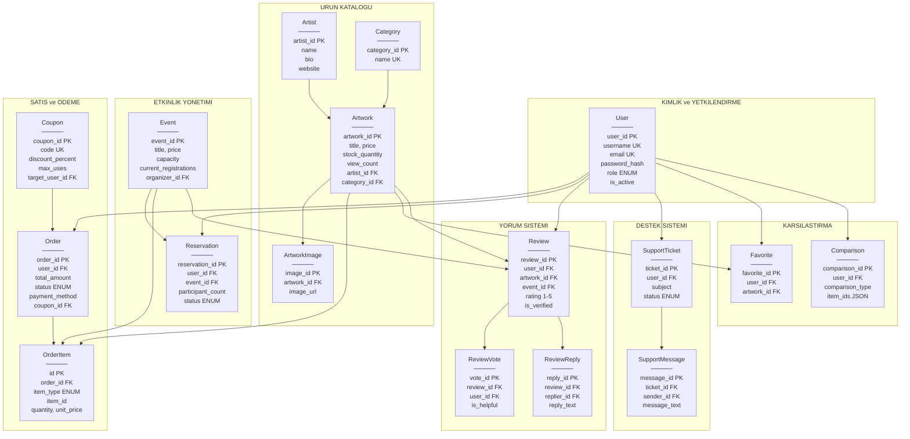

---

### Tablo Iliskileri Ozet Tablosu

| # | Tablo | Tablo Adi | PK | FK Baglantilari | Ozel Kisitlamalar |
|---|-------|-----------|-----|-----------------|-------------------|
| 1 | **User** | users | user_id | — | username UK, email UK |
| 2 | **Artist** | artists | artist_id | — | — |
| 3 | **Category** | categories | category_id | — | name UK |
| 4 | **Artwork** | artworks | artwork_id | artist_id, category_id | — |
| 5 | **ArtworkImage** | artwork_images | image_id | artwork_id | — |
| 6 | **Event** | events | event_id | organizer_id → User | — |
| 7 | **Reservation** | reservations | reservation_id | user_id, event_id | — |
| 8 | **Order** | orders | order_id | user_id, coupon_id | — |
| 9 | **OrderItem** | order_items | id | order_id | Polimorfik: item_type + item_id |
| 10 | **Favorite** | favorites | favorite_id | user_id, artwork_id | UNIQUE(user_id, artwork_id) |
| 11 | **Review** | reviews | review_id | user_id, artwork_id, event_id | En az bir hedef zorunlu |
| 12 | **ReviewVote** | review_votes | vote_id | review_id, user_id | UNIQUE(review_id, user_id) |
| 13 | **ReviewReply** | review_replies | reply_id | review_id, replier_id → User | — |
| 14 | **Coupon** | coupons | coupon_id | target_user_id → User | code UK |
| 15 | **SupportTicket** | support_tickets | ticket_id | user_id | — |
| 16 | **SupportMessage** | support_messages | message_id | ticket_id, sender_id → User | — |
| 17 | **Comparison** | comparisons | comparison_id | user_id | item_ids JSON array |

### Polimorfik Iliski: OrderItem

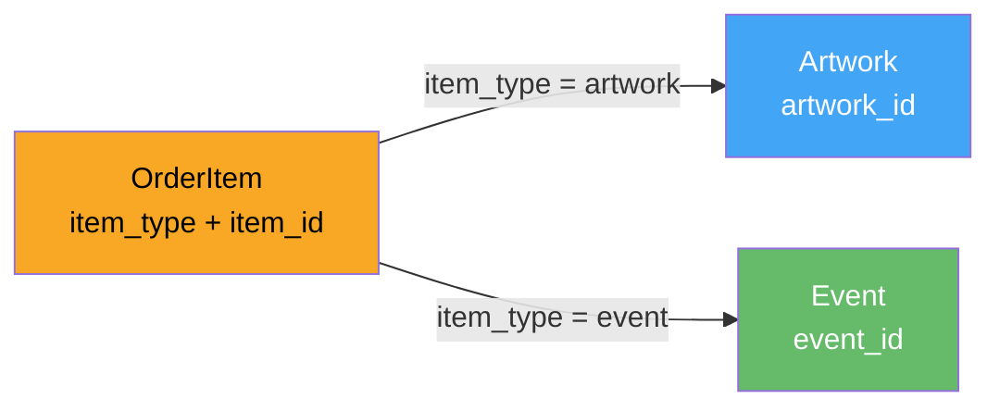

> **Not:** `OrderItem` tablosu **polimorfik ilişki** kullanır. `item_type` alanı `'artwork'` veya `'event'` değeri alır ve `item_id` ilgili tablonun PK'sına işaret eder. Sequelize'da `constraints: false` + `scope` ile tanımlanmıştır.

---

## Kullanıcı Akışları

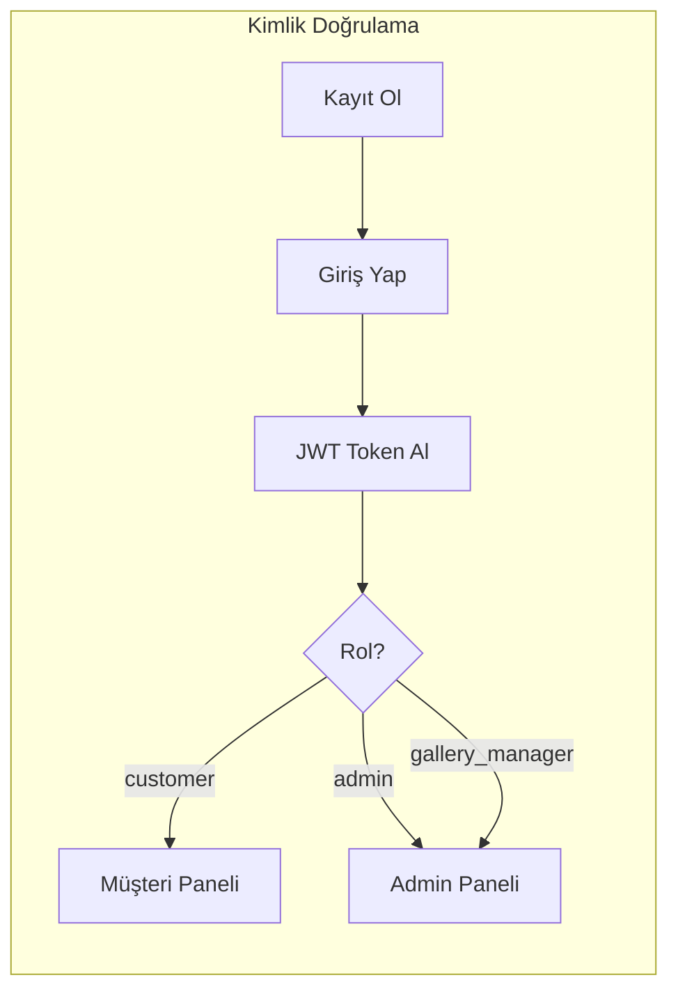

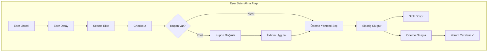

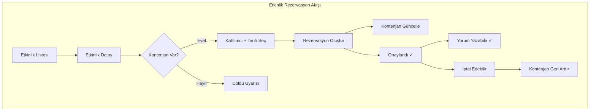

---

## API Endpoint Haritası

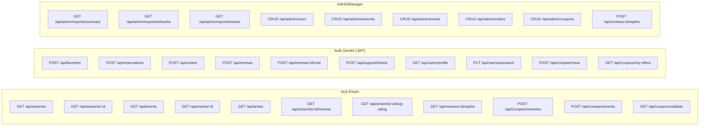

---

## Middleware Zinciri

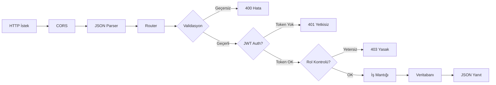

---

## Güvenlik Mimarisi

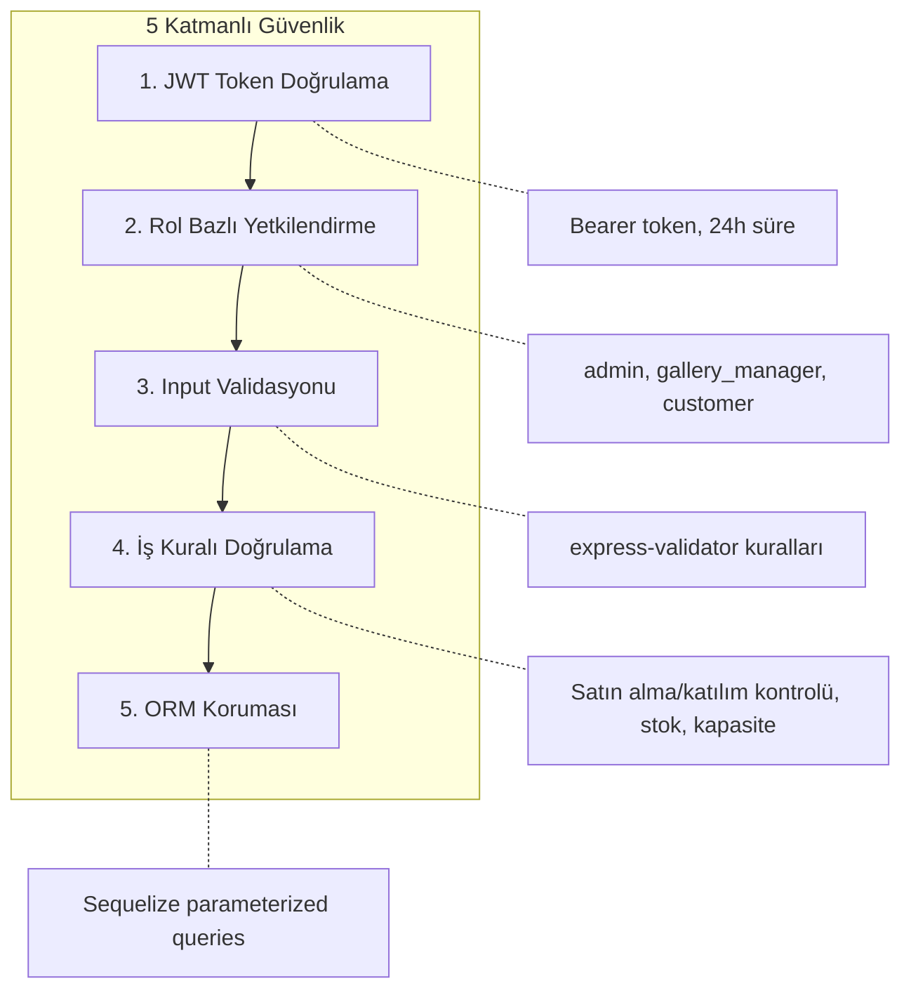

| Güvenlik Özelliği | Uygulama |
|-------------------|----------|
| Şifre Hash | bcryptjs, salt=12 |
| Token | JWT, 24 saat geçerlilik |
| Rol Kontrolü | `requireRole('admin', 'gallery_manager')` |
| Yorum Doğrulama | Satın alma + katılım kontrolü |
| Input Sanitize | `express-validator` trim, isEmail, isInt |
| SQL Injection | Sequelize ORM parameterized queries |
| UNIQUE Kısıtlama | Email, username, favori (409 Conflict) |

---

## Frontend Sayfa Haritası

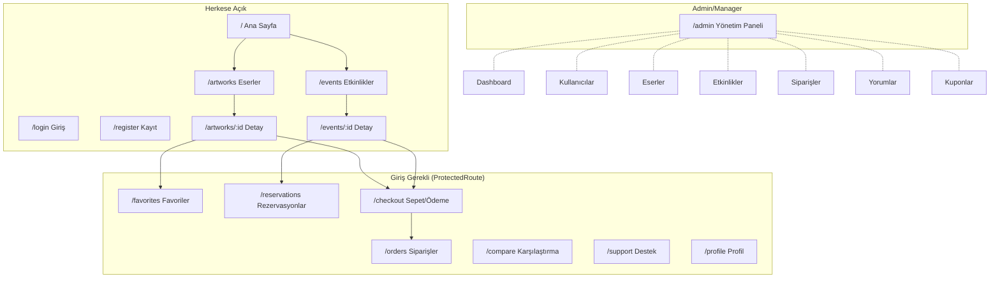

---

## State Yönetimi

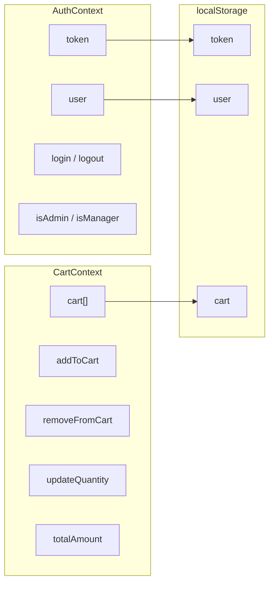

---

## Sipariş Yaşam Döngüsü

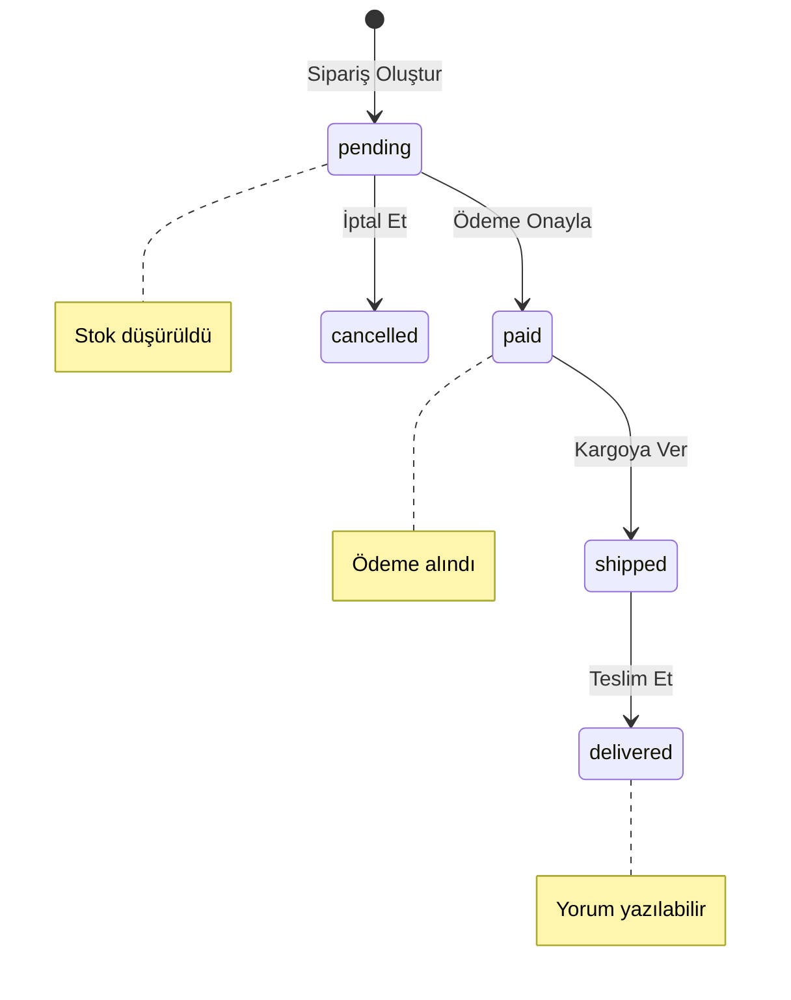

## Rezervasyon Yaşam Döngüsü

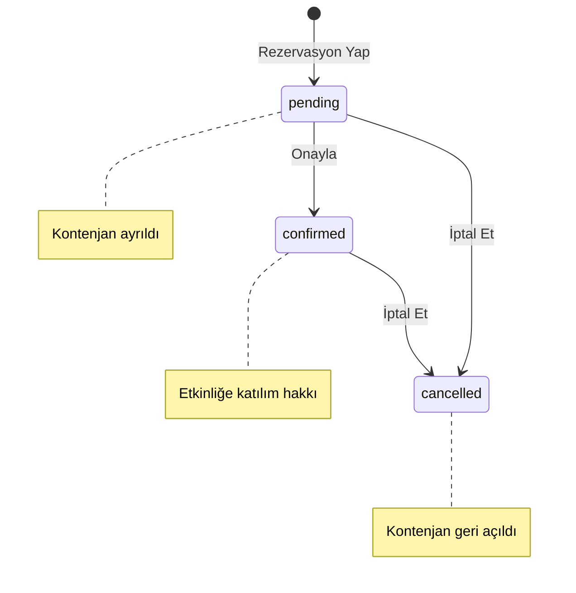

---

## Kurulum ve Çalıştırma

```bash
# 1. Backend
cd backend
npm install
npm run seed    # Örnek veri yükle (10 kullanıcı, 25 eser, 10 etkinlik)
npm run dev     # http://localhost:3001

# 2. Frontend
cd frontend
npm install
npm run dev     # http://localhost:5173
```

## Test Hesapları

| Rol | E-posta | Şifre |
|-----|---------|-------|
| Admin | admin@gallery.com | password123 |
| Manager | manager@gallery.com | password123 |
| Müşteri | ahmet@email.com | password123 |

---

## Yanıt Formatı (Standart)

```json
{
  "success": true,
  "data": { ... },
  "message": "İşlem başarılı"
}
```

```json
{
  "success": false,
  "data": null,
  "message": "Hata açıklaması"
}
```

**HTTP Durum Kodları:** `200` Başarılı, `201` Oluşturuldu, `400` Geçersiz İstek, `401` Yetkisiz, `403` Yasak, `404` Bulunamadı, `409` Çakışma, `500` Sunucu Hatası
