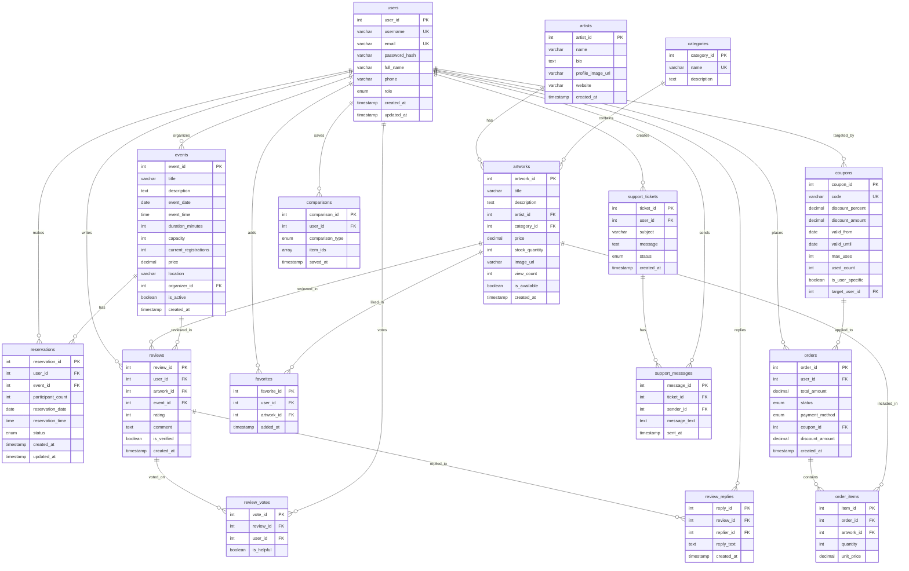

# ER Diagram — Online Sanat Galerisi

```mermaid
erDiagram
    users {
        int user_id PK
        varchar username UK
        varchar email UK
        varchar password_hash
        varchar full_name
        varchar phone
        enum role
        timestamp created_at
        timestamp updated_at
    }

    artists {
        int artist_id PK
        varchar name
        text bio
        varchar profile_image_url
        varchar website
        timestamp created_at
    }

    categories {
        int category_id PK
        varchar name UK
        text description
    }

    artworks {
        int artwork_id PK
        varchar title
        text description
        int artist_id FK
        int category_id FK
        decimal price
        int stock_quantity
        varchar image_url
        int view_count
        boolean is_available
        timestamp created_at
    }

    events {
        int event_id PK
        varchar title
        text description
        date event_date
        time event_time
        int duration_minutes
        int capacity
        int current_registrations
        decimal price
        varchar location
        int organizer_id FK
        boolean is_active
        timestamp created_at
    }

    reservations {
        int reservation_id PK
        int user_id FK
        int event_id FK
        int participant_count
        date reservation_date
        time reservation_time
        enum status
        timestamp created_at
        timestamp updated_at
    }

    orders {
        int order_id PK
        int user_id FK
        decimal total_amount
        enum status
        enum payment_method
        int coupon_id FK
        decimal discount_amount
        timestamp created_at
    }

    order_items {
        int item_id PK
        int order_id FK
        int artwork_id FK
        int quantity
        decimal unit_price
    }

    favorites {
        int favorite_id PK
        int user_id FK
        int artwork_id FK
        timestamp added_at
    }

    reviews {
        int review_id PK
        int user_id FK
        int artwork_id FK
        int event_id FK
        int rating
        text comment
        boolean is_verified
        timestamp created_at
    }

    review_votes {
        int vote_id PK
        int review_id FK
        int user_id FK
        boolean is_helpful
    }

    review_replies {
        int reply_id PK
        int review_id FK
        int replier_id FK
        text reply_text
        timestamp created_at
    }

    coupons {
        int coupon_id PK
        varchar code UK
        decimal discount_percent
        decimal discount_amount
        date valid_from
        date valid_until
        int max_uses
        int used_count
        boolean is_user_specific
        int target_user_id FK
    }

    support_tickets {
        int ticket_id PK
        int user_id FK
        varchar subject
        text message
        enum status
        timestamp created_at
    }

    support_messages {
        int message_id PK
        int ticket_id FK
        int sender_id FK
        text message_text
        timestamp sent_at
    }

    comparisons {
        int comparison_id PK
        int user_id FK
        enum comparison_type
        array item_ids
        timestamp saved_at
    }

    %% İlişkiler
    artists ||--o{ artworks : "has"
    categories ||--o{ artworks : "contains"
    users ||--o{ events : "organizes"
    users ||--o{ reservations : "makes"
    events ||--o{ reservations : "has"
    users ||--o{ orders : "places"
    orders ||--o{ order_items : "contains"
    artworks ||--o{ order_items : "included_in"
    users ||--o{ favorites : "adds"
    artworks ||--o{ favorites : "liked_in"
    users ||--o{ reviews : "writes"
    artworks ||--o{ reviews : "reviewed_in"
    events ||--o{ reviews : "reviewed_in"
    reviews ||--o{ review_votes : "voted_on"
    users ||--o{ review_votes : "votes"
    reviews ||--o{ review_replies : "replied_to"
    users ||--o{ review_replies : "replies"
    coupons ||--o{ orders : "applied_to"
    users ||--o{ coupons : "targeted_by"
    users ||--o{ support_tickets : "creates"
    support_tickets ||--o{ support_messages : "has"
    users ||--o{ support_messages : "sends"
    users ||--o{ comparisons : "saves"
```
