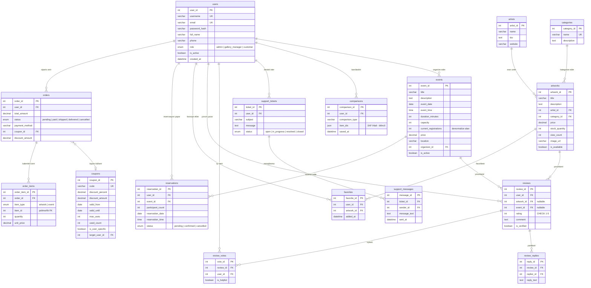

# 📄 SQL Çalışma Kağıdı — Savunma Sınavı Hazırlık
## Online Sanat Galerisi ve Atölye Rezervasyon Sistemi

> **Talimat:** Her soruyu okuyup SQL sorgusunu kendin yaz. Cevap hemen sorunun altında. Önce kendin dene, sonra cevabı kontrol et!

---

## 📊 Veritabanı Şeması (ER Diyagramı)



---

## BÖLÜM A: SELECT + WHERE + ORDER BY

---

### Soru 1 — `auth.js`
**Giriş yapmak isteyen bir kullanıcının e-posta adresine göre kaydını bul.**

```sql
-- Cevabını buraya yaz:

```

> **Cevap:**
> ```sql
> SELECT * FROM users WHERE email = ?;
> -- Uygulama katmanında: bcrypt.compare(input_password, stored_hash)
> -- Eşleşirse: JWT token üret (24 saat geçerli)
> -- Eşleşmezse: 401 Unauthorized
> ```

---

### Soru 2 — `artworks.js`
**Aktif olan, fiyatı 2000-5000 TL arasında, başlığında "İstanbul" geçen eserleri, en yeniden eskiye sırala. İlk 12 tanesini getir.**

```sql
-- Cevabını buraya yaz:

```

> **Cevap:**
> ```sql
> SELECT a.*, ar.artist_id, ar.name, c.category_id, c.name
> FROM artworks a
> LEFT JOIN artists ar ON a.artist_id = ar.artist_id
> LEFT JOIN categories c ON a.category_id = c.category_id
> WHERE a.is_available != false
>   AND a.price BETWEEN 2000 AND 5000
>   AND a.title LIKE '%İstanbul%'
> ORDER BY a.created_at DESC
> LIMIT 12 OFFSET 0;
> ```

---

### Soru 3 — `events.js`
**Aktif ve gelecek tarihli etkinlikleri, başlığında "Atölye" geçenleri, tarihe göre artan sırala. Sayfa 2 (limit=12).**

```sql
-- Cevabını buraya yaz:

```

> **Cevap:**
> ```sql
> SELECT e.*, u.username, u.full_name AS organizator
> FROM events e
> LEFT JOIN users u ON e.organizer_id = u.user_id
> WHERE e.is_active = 1
>   AND e.event_date >= CURRENT_DATE
>   AND e.title LIKE '%Atölye%'
> ORDER BY e.event_date ASC
> LIMIT 12 OFFSET 12;
> ```

---

### Soru 4 — `users.js`
**Bir kullanıcının profil bilgisini getir ama password_hash alanını HARİÇ tut.**

```sql
-- Cevabını buraya yaz:

```

> **Cevap:**
> ```sql
> SELECT user_id, username, email, full_name, phone, role,
>   is_active, created_at, updated_at
> FROM users WHERE user_id = ?;
> -- NOT: password_hash hariç tutulur (güvenlik — hassas veri)
> ```

---

## BÖLÜM B: JOIN Sorguları

---

### Soru 5 — `artworks.js`
**Eser detayını sanatçı ve kategori bilgisiyle birlikte getir. Ortalama puanı hesapla ve görüntülenme sayacını artır.**

```sql
-- Cevabını buraya yaz:

```

> **Cevap:**
> ```sql
> -- Ana sorgu: 4 tablo JOIN
> SELECT a.*, ar.*, c.*, r.*, u.username, u.full_name
> FROM artworks a
> LEFT JOIN artists ar ON a.artist_id = ar.artist_id
> LEFT JOIN categories c ON a.category_id = c.category_id
> LEFT JOIN reviews r ON a.artwork_id = r.artwork_id
> LEFT JOIN users u ON r.user_id = u.user_id
> WHERE a.artwork_id = ?;
>
> -- Ortalama puan (Aggregate Subquery)
> SELECT AVG(rating) AS avg_rating, COUNT(review_id) AS review_count
> FROM reviews WHERE artwork_id = ?;
>
> -- Görüntülenme sayacı artır
> UPDATE artworks SET view_count = view_count + 1 WHERE artwork_id = ?;
> ```

---

### Soru 6 — `favorites.js`
**Bir kullanıcının favori listesini, eser + sanatçı + kategori bilgisiyle getir (3 tablo JOIN).**

```sql
-- Cevabını buraya yaz:

```

> **Cevap:**
> ```sql
> SELECT f.*, a.*, ar.name AS sanatci, c.name AS kategori
> FROM favorites f
> INNER JOIN artworks a ON f.artwork_id = a.artwork_id
> LEFT JOIN artists ar ON a.artist_id = ar.artist_id
> LEFT JOIN categories c ON a.category_id = c.category_id
> WHERE f.user_id = ?
> ORDER BY f.added_at DESC;
> ```

---

### Soru 7 — `artists.js`
**Bir sanatçının profilini, eserlerini ve eserlerin kategorilerini getir (iç içe JOIN).**

```sql
-- Cevabını buraya yaz:

```

> **Cevap:**
> ```sql
> SELECT ar.*, a.*, c.name AS kategori
> FROM artists ar
> LEFT JOIN artworks a ON ar.artist_id = a.artist_id
> LEFT JOIN categories c ON a.category_id = c.category_id
> WHERE ar.artist_id = ?;
> ```

---

### Soru 8 — `support.js`
**Bir destek talebinin detayını, mesajlarını ve her mesaj gönderenin adını/rolünü getir (3 tablo JOIN).**

```sql
-- Cevabını buraya yaz:

```

> **Cevap:**
> ```sql
> SELECT t.*, m.*, u.username, u.full_name, u.role
> FROM support_tickets t
> LEFT JOIN support_messages m ON t.ticket_id = m.ticket_id
> LEFT JOIN users u ON m.sender_id = u.user_id
> WHERE t.ticket_id = ? AND t.user_id = ?
> ORDER BY m.sent_at ASC;
> ```

---

### Soru 9 — `reservations.js`
**Bir kullanıcının tüm rezervasyonlarını, etkinlik bilgisiyle birlikte, en yeniden eskiye sırala.**

```sql
-- Cevabını buraya yaz:

```

> **Cevap:**
> ```sql
> SELECT r.*, e.*
> FROM reservations r
> INNER JOIN events e ON r.event_id = e.event_id
> WHERE r.user_id = ?
> ORDER BY r.created_at DESC;
> ```

---

## BÖLÜM C: POLİMORFİK JOIN ⭐ (En Kritik!)

---

### Soru 10 — `orders.js` ⭐⭐⭐
**Bir kullanıcının siparişlerini, sipariş kalemlerini ve her kalemin ürün adını (eser VEYA etkinlik) getir. CASE WHEN ile polimorfik JOIN yaz.**

```sql
-- Cevabını buraya yaz:

```

> **Cevap:**
> ```sql
> SELECT o.*, oi.*,
>   CASE WHEN oi.item_type = 'artwork'
>     THEN a.title ELSE e.title END AS urun_adi
> FROM orders o
> INNER JOIN order_items oi ON o.order_id = oi.order_id
> LEFT JOIN artworks a ON oi.item_type = 'artwork'
>   AND oi.item_id = a.artwork_id
> LEFT JOIN events e ON oi.item_type = 'event'
>   AND oi.item_id = e.event_id
> WHERE o.user_id = ?
> ORDER BY o.created_at DESC;
> ```
> **Neden LEFT JOIN?** `item_type`'a göre sadece bir tablo eşleşir, diğeri NULL döner.

---

## BÖLÜM D: Aggregate Fonksiyonlar (GROUP BY, HAVING)

---

### Soru 11 — `artworks.js`
**Bir eserin ortalama puanını ve yorum sayısını hesapla.**

```sql
-- Cevabını buraya yaz:

```

> **Cevap:**
> ```sql
> SELECT AVG(rating) AS avg_rating, COUNT(review_id) AS review_count
> FROM reviews
> WHERE artwork_id = ?;
> ```

---

### Soru 12 — `admin.js`
**Her eserin yorum sayısını, favori sayısını ve ortalama puanını hesapla (GROUP BY + çoklu LEFT JOIN + DISTINCT).**

```sql
-- Cevabını buraya yaz:

```

> **Cevap:**
> ```sql
> SELECT a.artwork_id, a.title, a.price, a.view_count,
>   COUNT(DISTINCT r.review_id) AS review_count,
>   COUNT(DISTINCT f.favorite_id) AS like_count,
>   AVG(r.rating) AS avg_rating
> FROM artworks a
> LEFT JOIN reviews r ON a.artwork_id = r.artwork_id
> LEFT JOIN favorites f ON a.artwork_id = f.artwork_id
> GROUP BY a.artwork_id;
> ```
> **Neden DISTINCT?** İki LEFT JOIN çapraz çarpım yapar → COUNT şişer. DISTINCT bunu önler.

---

### Soru 13 — `compare.js`
**Seçilen eser ID'lerine göre (IN) eserleri sanatçı ve kategoriyle getir. Her biri için ortalama puanı hesapla.**

```sql
-- Cevabını buraya yaz:

```

> **Cevap:**
> ```sql
> SELECT a.*, ar.name AS sanatci, c.name AS kategori
> FROM artworks a
> LEFT JOIN artists ar ON a.artist_id = ar.artist_id
> LEFT JOIN categories c ON a.category_id = c.category_id
> WHERE a.artwork_id IN (?, ?, ?);
>
> -- Her eser için ayrıca:
> SELECT AVG(rating) AS avg_rating, COUNT(review_id) AS review_count
> FROM reviews WHERE artwork_id = ?;
> ```

---

### Soru 14 — `events.js`
**Bir etkinliğin ortalama puanını, yorum sayısını ve kalan kontenjanını hesapla.**

```sql
-- Cevabını buraya yaz:

```

> **Cevap:**
> ```sql
> -- Puan hesaplama
> SELECT AVG(rating) AS avg_rating, COUNT(review_id) AS review_count
> FROM reviews WHERE event_id = ?;
>
> -- Kalan kontenjan (hesaplanmış alan):
> -- capacity - current_registrations AS remaining_spots
> ```

---

## BÖLÜM E: INSERT + UPDATE + DELETE (DML)

---

### Soru 15 — `auth.js`
**Yeni bir kullanıcı kaydet. E-posta ve kullanıcı adı benzersiz olmalı (önce UNIQUE kontrol, sonra INSERT).**

```sql
-- Cevabını buraya yaz:

```

> **Cevap:**
> ```sql
> -- 1. E-posta benzersizlik kontrolü (UNIQUE constraint)
> SELECT * FROM users WHERE email = ?;
>
> -- 2. Kullanıcı adı benzersizlik kontrolü
> SELECT * FROM users WHERE username = ?;
>
> -- 3. Şifre hash'leme (bcrypt, salt=12, uygulama katmanı)
> -- 4. Kayıt oluştur
> INSERT INTO users (username, email, password_hash, full_name, phone)
> VALUES (?, ?, '$2a$12$...', ?, ?);
> ```

---

### Soru 16 — `orders.js` ⭐⭐⭐
**Bir sipariş oluştur: Transaction içinde sipariş INSERT et, polimorfik sipariş kalemi ekle, stoğu düşür, kupon kullanım sayısını artır.**

```sql
-- Cevabını buraya yaz:

```

> **Cevap:**
> ```sql
> BEGIN TRANSACTION;
>
> -- 1. Stok kontrolü
> SELECT * FROM artworks WHERE artwork_id = ? AND stock_quantity >= ?;
>
> -- 2. Kupon kontrolü
> SELECT * FROM coupons WHERE code = ?
>   AND valid_from <= NOW() AND valid_until >= NOW();
>
> -- 3. Sipariş oluştur
> INSERT INTO orders (user_id, total_amount, status, payment_method,
>   coupon_id, discount_amount) VALUES (?, ?, 'pending', ?, ?, ?);
>
> -- 4. Sipariş kalemleri (POLİMORFİK INSERT)
> INSERT INTO order_items (order_id, item_type, item_id, quantity,
>   unit_price) VALUES (?, 'artwork', ?, ?, ?);
>
> -- 5. Stok düşür
> UPDATE artworks SET stock_quantity = stock_quantity - ?
>   WHERE artwork_id = ?;
>
> -- 6. Kupon kullanım sayısı artır
> UPDATE coupons SET used_count = used_count + 1 WHERE coupon_id = ?;
>
> COMMIT;  -- Herhangi bir adım başarısız olursa: ROLLBACK;
> ```

---

### Soru 17 — `reservations.js`
**Yeni bir rezervasyon oluştur ve etkinliğin kontenjanını güncelle (denormalize alan).**

```sql
-- Cevabını buraya yaz:

```

> **Cevap:**
> ```sql
> -- 1. Çakışma kontrolü (aynı kullanıcı + aynı etkinlik)
> SELECT * FROM reservations
>   WHERE user_id = ? AND event_id = ? AND status != 'cancelled';
>
> -- 2. Rezervasyon oluştur
> INSERT INTO reservations (user_id, event_id, participant_count,
>   reservation_date, reservation_time, status)
>   VALUES (?, ?, ?, ?, ?, 'pending');
>
> -- 3. Kontenjanı güncelle (denormalize alan)
> UPDATE events SET current_registrations = current_registrations + ?
>   WHERE event_id = ?;
> ```

---

### Soru 18 — `reservations.js`
**Bir rezervasyonu iptal et (status='cancelled') ve etkinliğin kontenjanını geri aç.**

```sql
-- Cevabını buraya yaz:

```

> **Cevap:**
> ```sql
> UPDATE reservations SET status = 'cancelled'
>   WHERE reservation_id = ? AND user_id = ?;
>
> -- Kontenjanı geri aç (denormalize alanı güncelle)
> UPDATE events SET current_registrations = current_registrations - ?
>   WHERE event_id = ?;
> ```

---

### Soru 19 — `orders.js`
**Bir siparişin durumunu 'paid' olarak güncelle ama sadece 'pending' durumundaysa.**

```sql
-- Cevabını buraya yaz:

```

> **Cevap:**
> ```sql
> UPDATE orders SET status = 'paid'
> WHERE order_id = ? AND user_id = ? AND status = 'pending';
> -- WHERE'de status kontrolü → sadece pending sipariş onaylanabilir
> ```

---

### Soru 20 — `support.js`
**Yeni mesaj gönder ve talebin durumunu 'open' ise 'in_progress' yap (state machine).**

```sql
-- Cevabını buraya yaz:

```

> **Cevap:**
> ```sql
> INSERT INTO support_messages (ticket_id, sender_id, message_text)
> VALUES (?, ?, ?);
>
> -- Durum otomatik güncelleme (state machine)
> UPDATE support_tickets SET status = 'in_progress'
> WHERE ticket_id = ? AND status = 'open';
> ```

---

### Soru 21 — `users.js`
**Bir kullanıcının durumunu deaktif et ama kendi kendini deaktif etmesini engelle.**

```sql
-- Cevabını buraya yaz:

```

> **Cevap:**
> ```sql
> UPDATE users SET is_active = ?
> WHERE user_id = ? AND user_id != ?;
> -- İkinci ? = hedef kullanıcı, üçüncü ? = mevcut oturum sahibi
> -- Sadece role='admin' olan kullanıcı bu işlemi yapabilir
> ```

---

## BÖLÜM F: UNIQUE Constraint + Çakışma Kontrolü

---

### Soru 22 — `favorites.js`
**Favoriye eklemeden önce çift kayıt kontrolü yap (UNIQUE(user_id, artwork_id)), yoksa INSERT et.**

```sql
-- Cevabını buraya yaz:

```

> **Cevap:**
> ```sql
> -- 1. Çift favori kontrolü (Composite UNIQUE constraint)
> SELECT * FROM favorites WHERE user_id = ? AND artwork_id = ?;
> -- Eğer varsa: 409 Conflict dön
>
> -- 2. Favoriye ekle
> INSERT INTO favorites (user_id, artwork_id) VALUES (?, ?);
> ```

---

### Soru 23 — `reviews.js`
**Yorum oylama: Aynı kullanıcı aynı yoruma iki kez oy veremesin (UNIQUE kontrol + INSERT).**

```sql
-- Cevabını buraya yaz:

```

> **Cevap:**
> ```sql
> -- 1. Çift oy kontrolü (Composite UNIQUE constraint)
> SELECT * FROM review_votes
>   WHERE review_id = ? AND user_id = ?;
> -- Eğer varsa: 409 Conflict dön
>
> -- 2. Oy ekle
> INSERT INTO review_votes (review_id, user_id, is_helpful)
>   VALUES (?, ?, ?);
> ```

---

## BÖLÜM G: İş Kuralı Doğrulaması

---

### Soru 24 — `reviews.js` ⭐⭐⭐
**Yorum eklemeden önce kullanıcının eseri satın aldığını doğrula (INNER JOIN ile sipariş kontrolü). Polimorfik order_items tablosunu kullan.**

```sql
-- Cevabını buraya yaz:

```

> **Cevap:**
> ```sql
> -- 1. Satın alma kontrolü (INNER JOIN + polimorfik sorgu)
> SELECT o.order_id FROM orders o
> INNER JOIN order_items oi ON o.order_id = oi.order_id
> WHERE o.user_id = ? AND o.status IN ('paid', 'shipped', 'delivered')
>   AND oi.item_type = 'artwork' AND oi.item_id = ?;
>
> -- 2. Katılım kontrolü (etkinlik yorumu için)
> SELECT * FROM reservations
>   WHERE user_id = ? AND event_id = ? AND status = 'confirmed';
>
> -- 3. Yorum oluştur
> INSERT INTO reviews (user_id, artwork_id, event_id, rating,
>   comment, is_verified) VALUES (?, ?, ?, ?, ?, 1);
> ```

---

### Soru 25 — `coupons.js`
**Bir kullanıcıya uygun kuponları listele: Genel kuponlar VEYA kullanıcıya özel olanlar, süresi dolmamış.**

```sql
-- Cevabını buraya yaz:

```

> **Cevap:**
> ```sql
> SELECT * FROM coupons
> WHERE (is_user_specific = false OR target_user_id = ?)
>   AND valid_until >= CURRENT_DATE;
> ```

---

## 📈 Değerlendirme Tablosu

| Bölüm | Soru Sayısı | Doğru | Yanlış |
|-------|:-----------:|:-----:|:------:|
| A — SELECT / WHERE | 4 | ___ | ___ |
| B — JOIN | 5 | ___ | ___ |
| C — Polimorfik JOIN ⭐ | 1 | ___ | ___ |
| D — Aggregate | 4 | ___ | ___ |
| E — INSERT / UPDATE / DELETE | 7 | ___ | ___ |
| F — UNIQUE Constraint | 2 | ___ | ___ |
| G — İş Kuralı ⭐ | 2 | ___ | ___ |
| **TOPLAM** | **25** | ___**/25** | |

**Hedef:** ≥20/25 = Savunmaya hazırsın! 🎯

> ⭐ **Öncelik sırası:** Soru 10, 16, 24 (⭐⭐⭐ sorular) en kritik — bunları ezbere yazabilmelisin!
